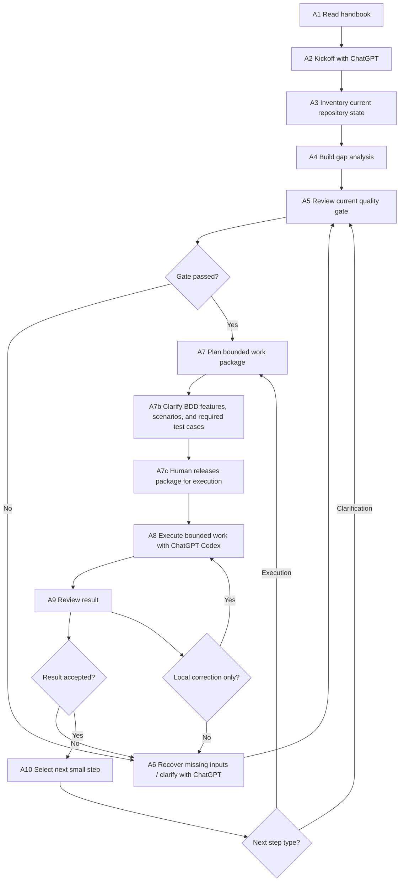

# Human-AI Process Flow

## Goal

This document shows the operational flow of the AI-assisted engineering process.

It complements the handbook, prompt set, and JSON templates with one visual process view.

The purpose is to make the working model easy to understand at a glance:

- how the human and ChatGPT move from one quality gate to the next
- when ChatGPT Codex is used for execution
- when the process returns from execution to clarification
- which inputs and outputs belong to each main activity
- where local loops are allowed and where a formal frame update is required

## Process overview

## Why this flow matters

The process is intentionally not a "prompt and hope" workflow.

It also does not require the human to define the full solution in advance.

Instead, it makes one thing explicit:

- the human and ChatGPT should clarify and inspect each work package before execution starts
- ChatGPT Codex should execute only bounded work inside the approved frame
- if execution reveals a missing input, conflict, or contradiction, the process should return to clarification
- learning from conflicts should be written back into the project frame, work package, or recovery log

## Activity table

| Activity | Purpose | Typical input | Typical output |
|---|---|---|---|
| A1 Read handbook | Understand the operating model before project work starts | `human_ai_project_handbook.md` | Shared understanding of roles, gates, and workflow |
| A2 Kickoff with ChatGPT | Start the collaboration in a structured way | GitHub repository, initial project intent, kickoff prompt | Kickoff summary and first framing results |
| A3 Inventory current repository state | Identify what already exists in the repository | Existing files, docs, structure, README files | Repository inventory |
| A4 Build gap analysis | Separate known, unclear, missing, and wrongly formatted information | Repository inventory, current discussion | Structured gap analysis |
| A5 Review current quality gate | Decide whether the next step is safe and clear enough | Current frame, current gate, known open points | Gate decision, blockers, or pass result |
| A6 Recover missing inputs / clarify with ChatGPT | Resolve ambiguity before execution continues | Missing facts, blocking questions, assumptions, Codex conflicts | Clarified inputs, updated frame, or explicit open points |
| A7 Plan bounded work package | Define one small and reviewable next step | Passed gate, constraints, expected output | Work-package definition and execution brief |
| A7b Clarify BDD features, scenarios, and required test cases | Make acceptance and verification visible before implementation | Work-package draft, test frame, state model, user-visible behavior | Approved scenarios, test-case set, unit/system split |
| A7c Human releases package for execution | Formally approve the bounded work package | Reviewed package, visible assumptions, accepted scenarios | Released execution package |
| A8 Execute bounded work with ChatGPT Codex | Implement approved work inside the declared frame | Approved work package, repository context, local environment | Code, documentation, tests, or other changed artifacts |
| A9 Review result | Check whether the result matches the frame | Delivered result, project frame, acceptance criteria | Review decision, follow-up actions, local correction, or rejection |
| A10 Select next small step | Decide the next clarification or execution step | Accepted result, open points, risks, next-step prompt | Next-step decision |

## Input / output mapping by activity

| Activity | Main input | Main output |
|---|---|---|
| A1 Read handbook | Handbook | Process understanding |
| A2 Kickoff with ChatGPT | Kickoff prompt, repository, human intent | Kickoff summary |
| A3 Inventory current repository state | Repository content | Inventory summary |
| A4 Build gap analysis | Inventory summary, discussion | Gap list |
| A5 Review current quality gate | Current frame, gate criteria | Pass / do not pass decision |
| A6 Recover missing inputs / clarify with ChatGPT | Missing information, blocking uncertainty, conflict report | Clarified facts, updated frame, or explicit open points |
| A7 Plan bounded work package | Passed gate, constraints | Work-package brief |
| A7b Clarify BDD features, scenarios, and required test cases | Work-package brief, state model, test frame | Accepted scenarios and test-case set |
| A7c Human releases package for execution | Reviewed package and scenarios | Released execution brief |
| A8 Execute bounded work with ChatGPT Codex | Approved work package | Changed files or implementation result |
| A9 Review result | Result, acceptance criteria | Accepted / follow-up / local correction / not accepted |
| A10 Select next small step | Review result, open points | Next gate or next package |

## Prompt and document mapping

| Activity | Main document or prompt |
|---|---|
| A1 Read handbook | `human_ai_project_handbook.md` |
| A2 Kickoff with ChatGPT | `human_ai_kickoff_prompt.md` |
| A3 Inventory current repository state | `repository_inventory_prompt.md` |
| A4 Build gap analysis | `gap_analysis_prompt.md` |
| A5 Review current quality gate | `quality_gate_review_prompt.md` |
| A6 Recover missing inputs / clarify with ChatGPT | `missing_input_recovery_prompt.md`, `failure_recovery_protocol.md`, `recovery_log.template.json` |
| A7 Plan bounded work package | `work_package_planning_prompt.md` and `ai_work_package_brief.template.md` |
| A7b Clarify BDD features, scenarios, and required test cases | `bdd_test_design_guideline.md`, `ai_test_case_brief.template.md`, `test_frame.template.json` |
| A7c Human releases package for execution | approved work-package brief |
| A8 Execute bounded work with ChatGPT Codex | `agent_workflow.template.json` plus the approved work package |
| A9 Review result | `end_of_package_review_prompt.md` |
| A10 Select next small step | `next_step_planning_prompt.md` |

## Allowed loops

### Local micro-loop

Use this loop for small implementation corrections.

Examples:

- naming cleanup inside an approved file set
- small test-fix adjustments
- documentation alignment after review

This loop is allowed as long as:

- product purpose does not change
- architecture boundaries do not change
- no new blocking open point appears
- the accepted BDD scenarios stay unchanged

### Recovery loop

Use this loop when execution reveals missing or conflicting input.

Typical triggers:

- a required file location is unclear
- a hardware boundary was not described clearly enough
- a scenario is not testable in its current wording
- Codex finds a conflict between frame and repository reality

In that case:

1. Codex stops
2. human + ChatGPT analyze the issue
3. package, frame, BDD/test definitions, or recovery log are updated
4. the relevant gate is reviewed again
5. Codex resumes only after release

### Frame-change loop

Use this loop when a conflict affects the project frame.

Examples:

- tool authority changed
- generated vs handwritten ownership changed
- test split changed
- new architecture restriction became necessary

In that case:

- return to the affected earlier gate
- update project or architecture constraints
- review the updated frame
- define a new or revised work package
- release bounded execution again

## Escalation rule

A local issue stays local only if:

- it does not change architecture boundaries
- it does not change product behavior
- it does not change the test model
- it does not invalidate approved scenarios
- it does not require a new global rule

Otherwise, the issue escalates into a frame or gate update.

## Reading guide

Use the documents in this practical order:

1. `human_ai_project_handbook.md`
2. `human_ai_kickoff_prompt.md`
3. `repository_inventory_prompt.md`
4. `gap_analysis_prompt.md`
5. `quality_gate_review_prompt.md`
6. `missing_input_recovery_prompt.md` when needed
7. `work_package_planning_prompt.md`
8. `bdd_test_design_guideline.md`
9. `end_of_package_review_prompt.md`
10. `next_step_planning_prompt.md`

## Summary

The process is not a one-way line from idea to implementation.

It is a controlled loop:

- clarify with ChatGPT
- pass the next quality gate
- define one bounded work package
- make BDD features, scenarios, and required tests visible before implementation
- release execution explicitly
- execute bounded work with ChatGPT Codex
- review the result
- return to clarification if necessary
- continue with the next small step

That loop is the practical operating flow of the AI-assisted engineering process.
