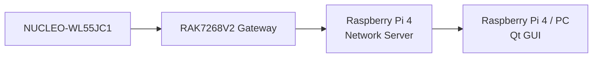

# Entwicklung eines lokalen LoRaWAN-basierten Messdatenerfassungssystems mit grafischer Visualisierung

## 1. Projektauftrag

------

### 1.1. Ausgangssituation

Im Rahmen der Entwicklung moderner Embedded- und IoT-Systeme besteht die Anforderung, Sensordaten drahtlos zu erfassen, zuverlässig zu übertragen und in Echtzeit visuell darzustellen.

Ziel ist der Aufbau eines vollständig lokal betriebenen Systems (Laborumgebung), das ohne externe Cloud-Dienste auskommt und alle Systemkomponenten – von der Sensorik bis zur Visualisierung – integriert.

Als technologische Basis dienen:

- NUCLEO-WL55JC1 als LoRaWAN-Endgerät
- RAK7268 WisGate Edge Lite 2 als Gateway
- Raspberry Pi 4 als lokaler Network Server (Backend)
- Qt/QML-basierte Anwendung zur Visualisierung

------

## 1.2. Zielsetzung

Ziel des Projekts ist die Entwicklung eines funktionierenden Gesamtsystems zur:

- Erfassung von Sensordaten auf einem Embedded-System
- drahtlosen Übertragung der Daten mittels LoRaWAN
- lokalen Verarbeitung und Bereitstellung der Daten
- grafischen Darstellung in Form eines Live-Plots (Oszilloskop-ähnlich)

Das System soll modular aufgebaut, nachvollziehbar dokumentiert und erweiterbar sein.

------

## 1.3. Projektumfang

Der Projektumfang umfasst die Konzeption, Implementierung und Integration der folgenden Systembestandteile:

#### 1.3.1 Embedded-System (Endgerät)

- Implementierung der Sensordatenerfassung
- Aufbereitung und Kodierung der Messdaten
- Integration eines LoRaWAN-Stacks
- periodische oder ereignisbasierte Datenübertragung

### 1.3.2 Funkinfrastruktur

- Einrichtung und Konfiguration des LoRaWAN-Gateways
- Integration in das lokale Netzwerk

### 1.3.3 Backend / Network Server

- Aufbau eines lokalen LoRaWAN Network Servers (z. B. ChirpStack)
- Verwaltung der Geräte (Join, Keys, Routing)
- Bereitstellung der Daten über MQTT

### 1.3.4 Datenverarbeitung

- Empfang der Daten über MQTT
- Dekodierung und Transformation in ein internes Datenmodell
- Pufferung der Daten zur Weiterverarbeitung

### 1.3.5 Visualisierung

- Entwicklung einer grafischen Oberfläche mit Qt/QML
- Darstellung der Messdaten als Live-Plot
- grundlegende Interaktionsmöglichkeiten (z. B. Start/Stop)

------

## 1.4. Systemabgrenzung

Nicht Bestandteil des Projekts sind:

- Integration externer Cloud-Dienste
- produktionsreife Hardwareentwicklung
- sicherheitszertifizierte oder normkonforme Umsetzung
- hochfrequente Echtzeitmessungen im Sinne eines Laboroszilloskops

------

## 1.5. Rahmenbedingungen

- Betrieb in einer lokalen Laborumgebung
- Nutzung von Open-Source-Software, wo sinnvoll
- Fokus auf Verständlichkeit, Modularität und Erweiterbarkeit
- Entwicklung auf vorhandener Hardware (Raspberry Pi 4, PC)

------

## 1.6. Ergebnisse / Deliverables

Am Ende des Projekts sollen folgende Ergebnisse vorliegen:

- Funktionsfähiges End-to-End-System (Sensor → GUI)
- lauffähige Embedded-Firmware
- konfiguriertes LoRaWAN-Backend
- GUI-Anwendung zur Visualisierung
- Dokumentation der Systemarchitektur
- strukturierter Quellcode (GitHub Repository)

------

## 1.7. Erfolgskriterien

Das Projekt gilt als erfolgreich, wenn:

- Sensordaten zuverlässig übertragen werden
- das Endgerät sich erfolgreich per OTAA in das Netzwerk einbucht
- Daten im Backend empfangen und verarbeitet werden
- die GUI die Daten in Echtzeit darstellen kann
- das System stabil im Dauerbetrieb läuft

------

## 1.8. Risiken und Annahmen

### Risiken

- Komplexität der LoRaWAN-Infrastruktur
- Fehlkonfiguration von Gateway oder Network Server
- Einschränkungen durch LoRaWAN-Datenrate und Latenz

### Annahmen

- Hardware ist funktionsfähig und verfügbar
- Netzwerkverbindung im lokalen Umfeld stabil
- Open-Source-Komponenten funktionieren wie dokumentiert

------

## 1.9. Projektcharakter

Das Projekt dient als:

- Demonstrator für ein modernes IoT-System
- Referenzarchitektur für Embedded-Wireless-Anwendungen
- Grundlage für weiterführende Entwicklungen (z. B. Edge AI, Multi-Node-Systeme)

------

## 1.10. Startfreigabe

Mit diesem Projektauftrag wird die Umsetzung des Systems freigegeben.

------

## 2. Geräte + Software

- ✅ **was ist vorhanden (Open Source / Standard)**
- 🔧 **was musst du selbst entwickeln**

------

# 🧭 🏗️ Gesamtsystem (dein Labor)

------

# 📡 1. Gerät: NUCLEO-WL55JC1 (LoRaWAN Endgerät)

## 📦 Hardware

- NUCLEO-WL55JC1

## 🧠 Software / Stacks

| Komponente                 | Beschreibung                  | Status                  |
| -------------------------- | ----------------------------- | ----------------------- |
| STM32CubeWL HAL/LL         | Hardware Abstraction Layer    | ✅ Open Source (ST)      |
| BSP                        | Board Support Package         | ✅                       |
| LoRaWAN Stack              | LoRaWAN MAC + PHY             | ✅ (ST Middleware)       |
| Beispielprojekt (End Node) | OTAA Join + Senden            | ✅                       |
| Sensor-Treiber             | I2C / SPI / ADC               | 🔧 teilweise selbst      |
| Payload-Encoding           | Datenstruktur (z. B. Samples) | 🔧 **selbst entwickeln** |
| Application Logic          | Sampling, Buffering           | 🔧 **selbst entwickeln** |

------

# 📡 2. Gerät: LoRaWAN Gateway

## 📦 Hardware

- RAK7268 WisGate Edge Lite 2

## 🧠 Software / Stacks

| Komponente                        | Beschreibung          | Status           |
| --------------------------------- | --------------------- | ---------------- |
| Gateway OS (Linux)                | läuft auf Gateway     | ✅ vorinstalliert |
| Packet Forwarder / Basics Station | LoRaWAN Weiterleitung | ✅                |
| Webinterface                      | Konfiguration         | ✅                |
| Netzwerk (LTE/WLAN/Ethernet)      | IP-Verbindung         | ✅                |

👉 **Hier musst du nichts entwickeln**
👉 nur konfigurieren

------

# 🖥️ 3. Gerät: Raspberry Pi 4 #1 (Network Server)

## 📦 Hardware

- Raspberry Pi 4 (vorhanden)

## 🧠 Software / Stacks

| Komponente              | Beschreibung                | Status            |
| ----------------------- | --------------------------- | ----------------- |
| Linux (Raspberry Pi OS) | Betriebssystem              | ✅                 |
| ChirpStack              | LoRaWAN Network Server      | ✅ Open Source     |
| PostgreSQL              | Datenbank                   | ✅                 |
| Redis                   | Cache                       | ✅                 |
| Eclipse Mosquitto       | Messaging                   | ✅                 |
| Gateway Bridge          | Verbindung Gateway → Server | ✅                 |
| Payload Decoder         | JSON Mapping                | 🔧 optional selbst |

👉 Ergebnis:

- MQTT liefert dir fertige JSON-Daten

------

# 🖥️ 4. Gerät: Raspberry Pi 4 #2 oder PC (GUI)

## 📦 Hardware

- Raspberry Pi 4 **oder** PC

## 🧠 Software / Stacks

| Komponente                    | Beschreibung  | Status                  |
| ----------------------------- | ------------- | ----------------------- |
| Linux / Windows               | OS            | ✅                       |
| Qt 6                          | GUI Framework | ✅                       |
| Qt MQTT (oder libmosquitto)   | MQTT Client   | ✅                       |
| Datenparser (JSON → Struktur) | Mapping       | 🔧 **selbst entwickeln** |
| Ringbuffer                    | für Plot      | 🔧 **selbst entwickeln** |
| Plot / Oszilloskop            | Darstellung   | 🔧 **selbst entwickeln** |

------

# 🔌 End-to-End Protokolle

| Strecke          | Protokoll              |
| ---------------- | ---------------------- |
| Sensor → STM32   | ADC / I2C / SPI        |
| STM32 → Gateway  | **LoRaWAN (LoRa PHY)** |
| Gateway → Server | UDP / TLS              |
| Server → GUI     | **MQTT (JSON)**        |
| GUI intern       | C++ / Qt               |

------

# 🧠 Was musst du wirklich selbst entwickeln?

👉 Das ist der wichtigste Teil für dich:

## 🔧 Auf dem STM32

- Messwert-Erfassung
- Buffering (z. B. 64 Samples)
- Payload-Format

------

## 🔧 Auf dem Raspberry Pi / GUI

- MQTT-Client
- JSON → Datenstruktur
- Ringbuffer
- Plot / Oszilloskop

------

## 🔧 Optional

- eigener Payload Decoder (im Server)
- Logging / Replay
- Trigger-Funktion (wie Oszilloskop)

------

# 🎯 Minimaler Entwicklungsaufwand (realistisch)

## Was ist „fertig“:

- LoRaWAN Stack
- Gateway
- Network Server
- MQTT Infrastruktur

## Was du baust:

👉 **die eigentliche Anwendungsschicht**

- Datenmodell
- Visualisierung
- Embedded Logik

------

# 🧩 Architektur-Einordnung

Du baust damit:

👉 **ein komplettes Edge-IoT-System**

- Embedded (STM32)
- Funk (LoRaWAN)
- Backend (ChirpStack)
- Messaging (MQTT)
- Frontend (Qt)

------

# 🚀 Fazit

👉 Deine Geräteliste ist **100 % korrekt**
👉 Du nutzt maximal vorhandene Software
👉 Du entwickelst nur das, was wirklich Mehrwert bringt

